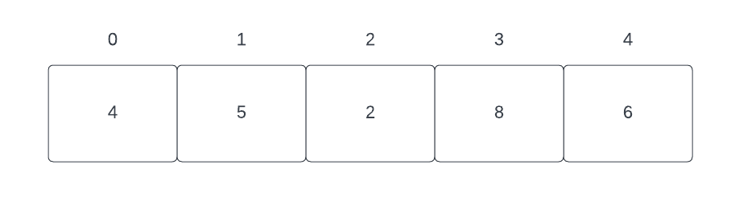

An <b>array</b> is a data structure that stores a collection of elements of the same type in contiguous memory locations. A <b>static array</b> is an array with a fixed size that cannot be resized after initialization. A <b>dynamic array</b> is an array with automatic resizing, allowing elements to be added or removed dynamically.

---

| Methods | Time Complexity | Space Complexity | Description |
| :- | :- | :- | :- |
| `Array()` | $\mathcal{O}(1)$ | $\mathcal{O}(1)$ | Constructor that creates an empty array. |
| `Array(capacity)` | $\mathcal{O}(1)$ | $\mathcal{O}(1)$ | Constructor that creates an array with a specified initial capacity. |
| `Array(list)` | $\mathcal{O}(n)$ | $\mathcal{O}(1)$ | Constructor that creates an array from a list, copying elements. |
| `~Array()` | $\mathcal{O}(1)$ | $\mathcal{O}(1)$ | Destructor that deallocates memory used by the array. |
| `operator=list` | $\mathcal{O}(n)$ | $\mathcal{O}(1)$ | Assignment operator that copies elements from an initializer list. |
| `operator=array` | $\mathcal{O}(n)$ | $\mathcal{O}(1)$ | Assignment operator that copies elements from another array.|
| `operator[]` | $\mathcal{O}(1)$ | $\mathcal{O}(1)$ | Access operator that returns the element at a specific index. |
| `size()` | $\mathcal{O}(1)$ | $\mathcal{O}(1)$ | Method that returns the number of elements in the array. |
| `push_back()` | $\mathcal{O}(1)$ | $\mathcal{O}(1)$ | Method that adds an element to the end of the array. |
| `pop_back()` | $\mathcal{O}(1)$ | $\mathcal{O}(1)$ | Method that removes the last element from the array. |
| `insert()` | $\mathcal{O}(n)$ | $\mathcal{O}(1)$ |Method that inserts an element at a specified position. |
| `erase()` | $\mathcal{O}(n)$ | $\mathcal{O}(1)$ | Method that removes an element at a specified position. |
| `begin()` | $\mathcal{O}(1)$ | $\mathcal{O}(1)$ | Method that returns an iterator to the beginning of the array. |
| `end()` | $\mathcal{O}(1)$ | $\mathcal{O}(1)$ | Method that returns an iterator to the end of the array. |

$n$ represents the number of elements in the array.

---